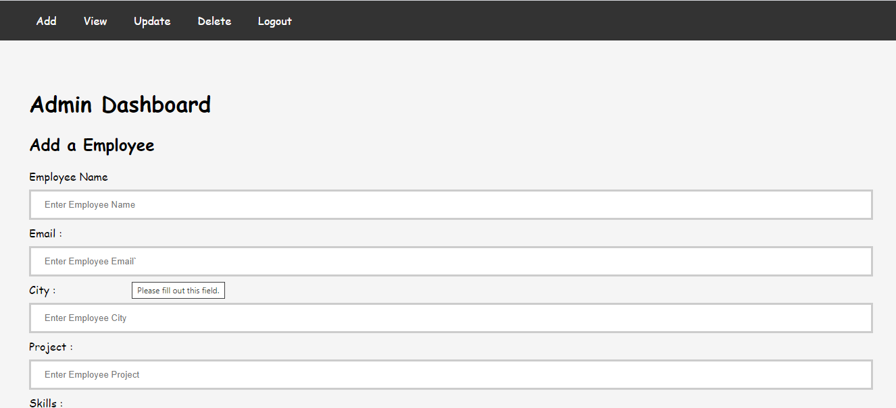
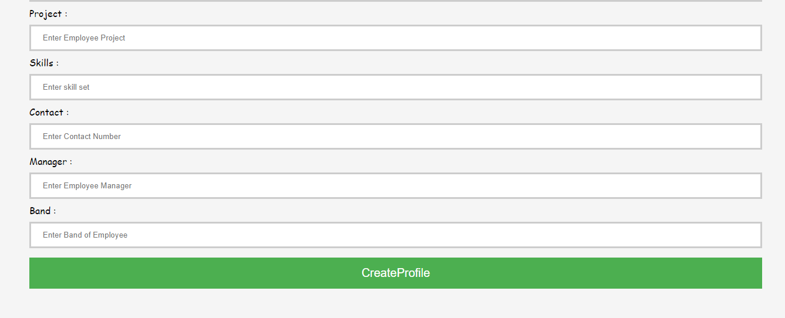
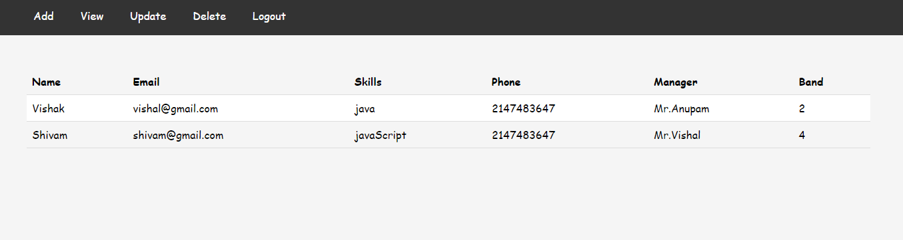
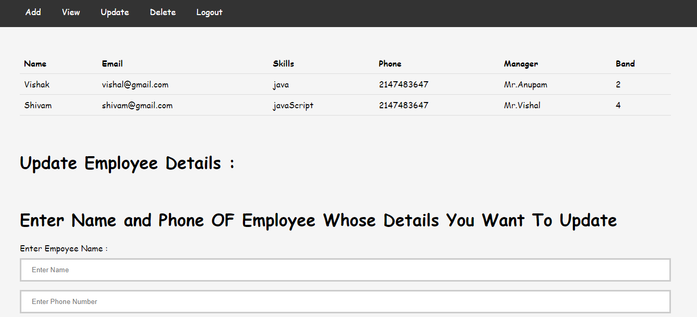
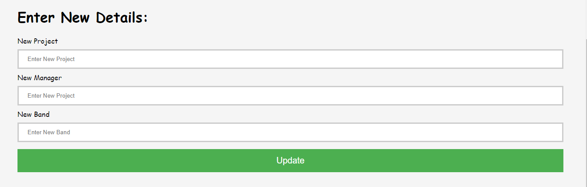
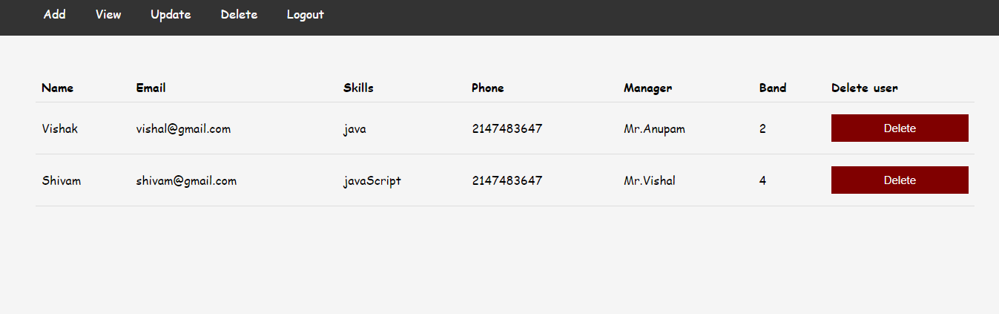

# Office Collaborator

<b>Technology used </b> 
 
1 . <b> Node JS and Express JS (Backend) </b>  
2 . <b> Mysql (Database)  </b> 
3 . html/css (Front End) 

 
<b> Code Editor used : VS Code </b> 

<b> index.js file contains all the backend program</b>  
in views directory all ejs program files and  in assets directory which is in public directory the css programe files are present 
    

## first page of the application 

# If user clicks on Employee Operations
<b>The default password of all Employees is 123   </b>

## If user enters Valid credentials , user redirected to Employee Dashboard page 

## If user clicks on Search Employee 
There are three ways to search an Employee  
1. Search by Name 
2. Search by Project 
3. Search by Designation  
4. Search by Address 

 

## If user clicks on Edit Details

 
 

There are options like :  
1. Update skill 
2. Change Password 
3. Change Password  
4. Change phone  
5. Change Location 

## If user clicks on Managers details 
The profile of All CEOs  will be displayed

## If user will click on logout the session will be destroyed and the user redirected to login page

## All functionalities of Employee are implemented ,   lets's see Admin functionalities 

## If user clicks on Admin(Manager) Operations

  if user enter the valid credintials  
he will be loggedin as admin  
else 
he have to create his profile first  
<b>Create a profile page : </b>

 
after creating profile user will be rdirected to Admin's Login page

## After Entering the valid credentials the user will redirected to Admin's Dashboard
<b>Here the first functionality is to add a new employee by creating Employee's Profile</b>

## Manager can view the Existing Employees 

## Manager can Update some Information of Employee
<b> Manager first have to Enter the Phone number and of Employe whose details he wants to edit  </b>

<b>Then Manager can enter the new skills</b>

## Manager can delete the employee's details by clicking on delete 

## after clicking on logout 
<b> The manager is redirected to login page again</b>

 
 

