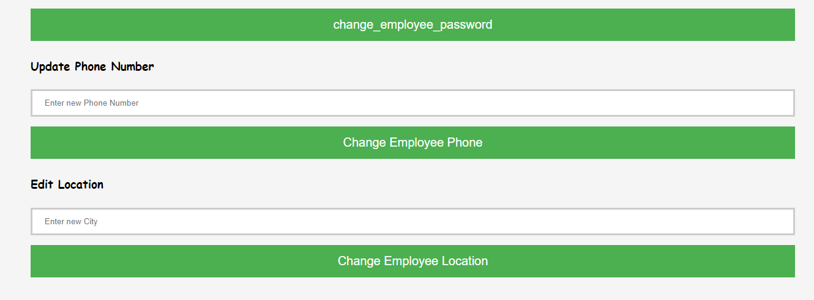

# Employee_Management_System

## first page of the application 

# If user clicks on Employee Operations 

## If user enters Valid credentials , user redirected to Employee Dashboard page 

## If user clicks on Search Employee 
There are three ways to search an Employee  
1. Search by Name 
2. Search by Project 
3. Search by Designation  
4. Search by Address 

 

## If user clicks on Edit Details

 
 

There are options like : /br>
1. Update skill 
2. Change Password 
3. Change Password  
4. Change phone  
5. Change Location 

## If user clicks on Managers details 
The profile of All CEOs  will be displayed

## If user will click on logout the session will be destroyed and the user redirected to login page

## All functionalities of Employee are implemented ,   lets's see Admin functionalities 

## If user clicks on Admin Operations

  if user enter the valid credintials  
he will be loggedin as admin  
else 
he have to c reate his profile first  
<b>Create a profile page : </b>

 
after creating profile user will be rdirected to Admin's Login page

